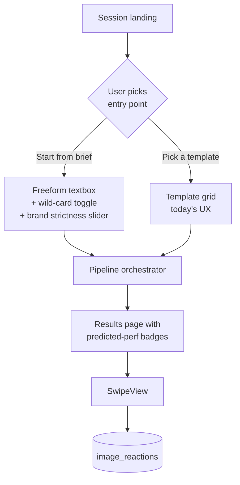
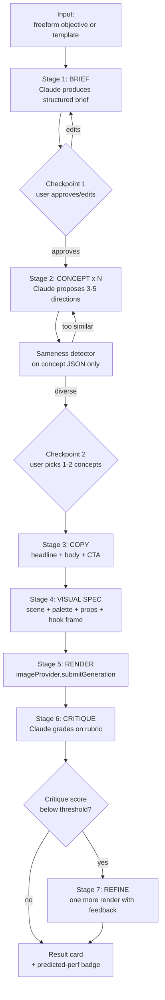
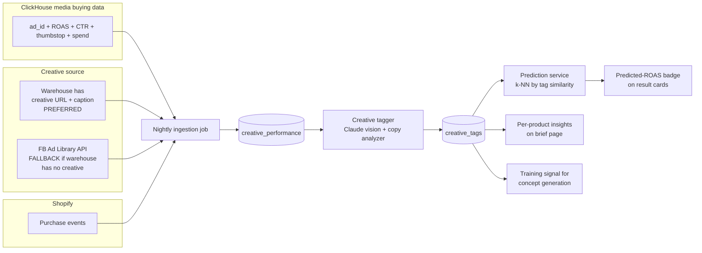
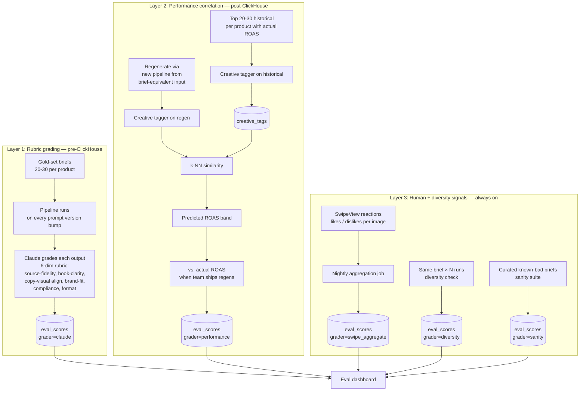
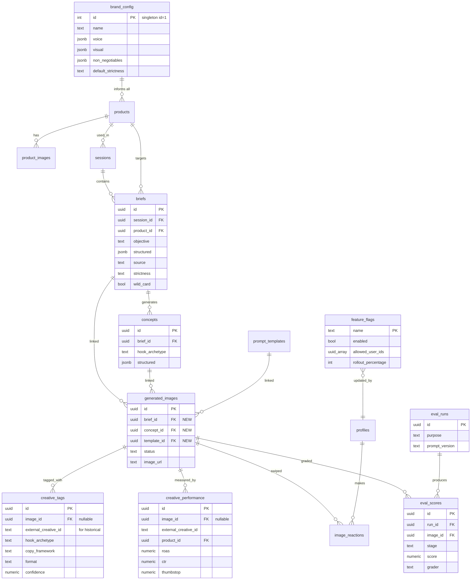
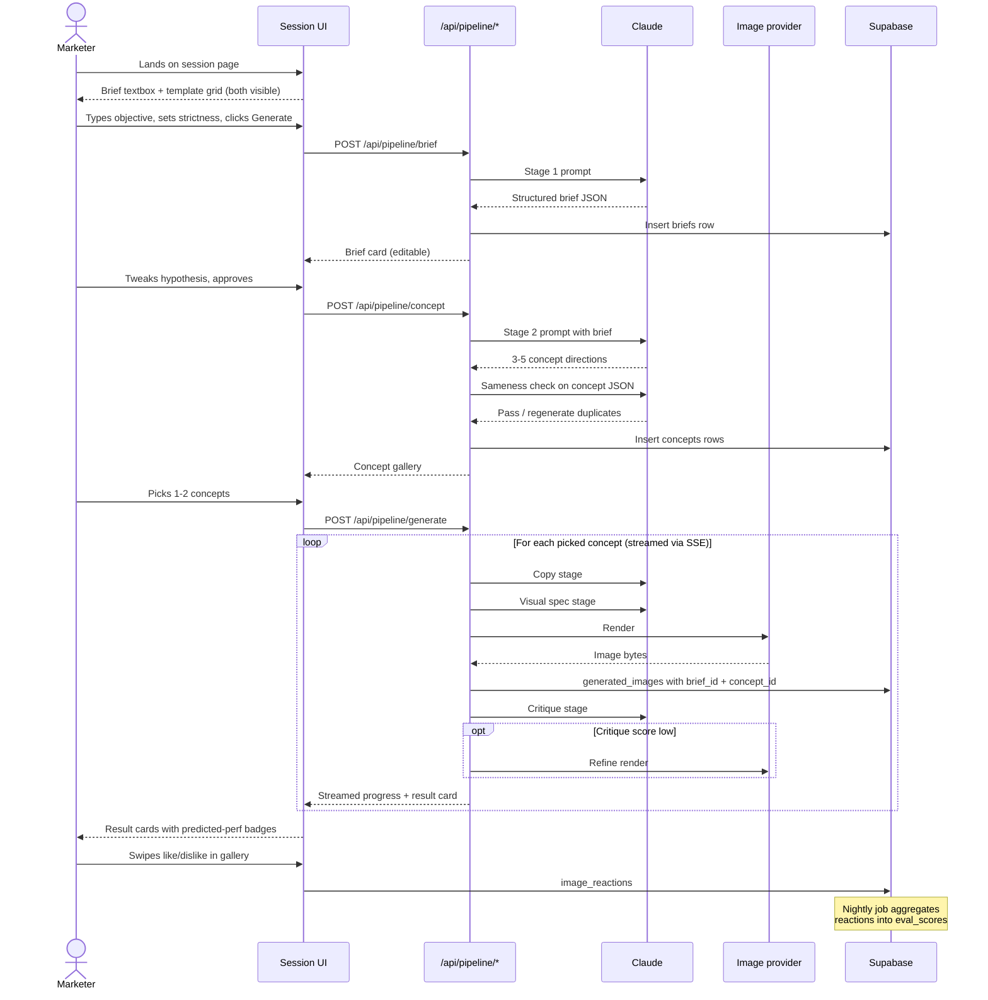

# TAE Ad Studio — Visual Flows

> **SUPERSEDED (2026-07-10):** flows 2–3 (brief-first pipeline) have been replaced by the **Concept Forge** workspace (`app/session/[id]/forge`). Kept for history.

Mermaid diagrams. Render inline on GitHub, VS Code (with Mermaid preview extension), or any modern Markdown viewer.

---

## 1. How the app works today

The current system is a template-fill pipeline. No LLM reasoning in the generation path.

```mermaid
flowchart LR
    U[User] --> S[Pick product]
    S --> T[Pick template from grid<br/>50+ fixed strings]
    T --> PA[prompt-assembler.ts<br/>mechanical placeholder fill]
    PA --> BR[Prepend brand DNA<br/>prompt_modifier + claims + compliance]
    BR --> AR[Append aspect ratio hint]
    AR --> IP[imageProvider.submitGeneration<br/>xAI today, Vertex target]
    IP --> ST[Supabase Storage]
    ST --> R[Results page]
    R --> SV[Gallery SwipeView<br/>like / dislike]
    SV --> IR[(image_reactions)]
```

**Weakness:** every ad for a product comes from the same templates + same `product.context`. Structural sameness. No reasoning. No performance signal.

---

## 2. V1 target — session entry (both paths visible)

Landing page has two co-equal entry points. User chooses per session.

---

## 3. Multi-stage pipeline detail

What happens inside the orchestrator. Two visible user checkpoints; everything else streams silently with a "Show my thinking" drawer.

Each stage is a pure function `(input, context) → structured JSON`, implemented as a Claude call using the synthesize-route pattern. Outputs persisted in `briefs` + `concepts` so any stage is replayable.

---

## 4. Performance loop — ingestion + tagging + prediction

Once ClickHouse access lands. Two ingestion paths depending on whether the warehouse stores creative assets.

**Key decision:** ask the team for creative URLs in the warehouse export. FB Ad Library is the fallback, not the default — library coverage is patchy and API access takes 1-2 weeks to provision.

---

## 5. Eval harness — two layers

Shipped separately. Layer 1 works on day 1; Layer 2 needs the performance loop running.

---

## 6. Data model at a glance (after all V1 migrations)

Simplified ER of the new additions. Brand is a singleton (not a multi-row table) because this is a single-tenant internal tool.

---

## 7. User journey — brief-first path (happy path)

What a marketer experiences end-to-end when using the new flow. Template path is unchanged.

